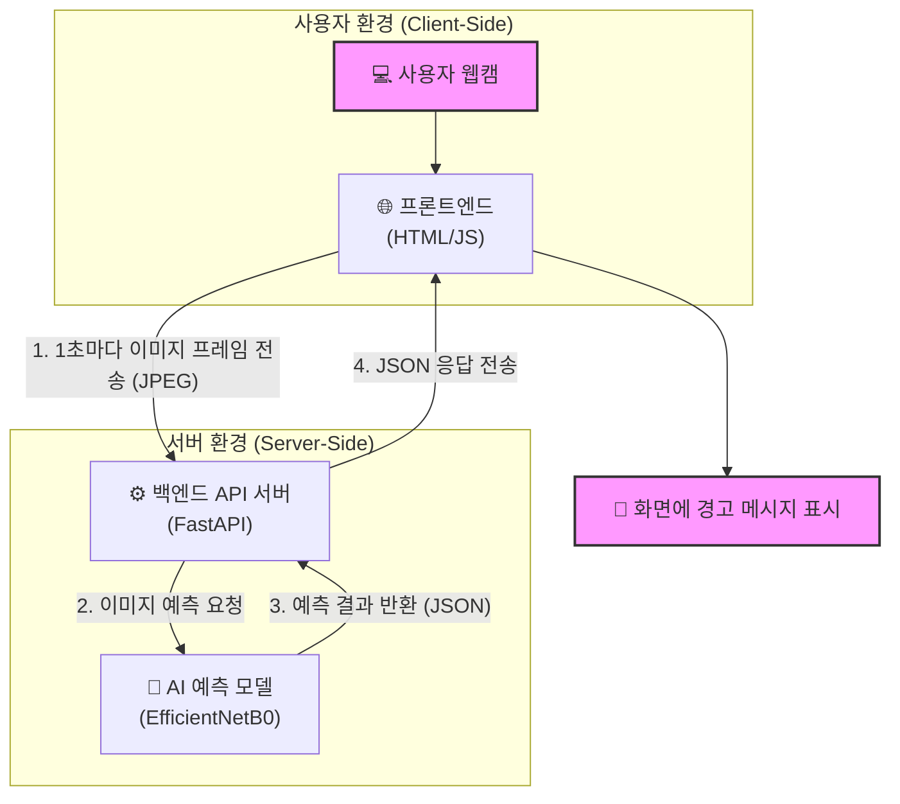

# 👁️ 실시간 VDT 증후군 예방 AI 모니터링 시스템 'C-Care'

<p align="center">
    
    
    
    
    
</p>

<br>

> 웹캠으로 사용자의 얼굴을 분석하여 모니터와의 거리를 실시간으로 예측하고, 자세 교정을 위한 경고를 제공하는 AI 서비스입니다.

<br>

<p align="center">
  
</p>
<br>

## 📌 개요 및 개발 동기

컴퓨터 사용 시간이 길어지면서 발생하는 VDT 증후군(거북목, 눈 피로 등)은 많은 현대인의 건강 문제입니다. 이 프로젝트는 **AI 기술을 활용해 사용자가 무의식적으로 모니터에 가까워지는 습관을 인지하고 교정**할 수 있도록 돕기 위해 시작되었습니다. 웹캠을 통해 실시간으로 사용자와 모니터 간의 거리를 3단계(안전, 주의, 위험)로 분류하고 즉각적인 피드백을 제공함으로써, 사용자의 건강한 디지털 생활 습관 형성에 기여하고자 합니다.

<br>

## ✨ 주요 기능

- **실시간 얼굴 감지:** `RetinaFace` 모델을 활용하여 웹캠 영상에서 사용자의 얼굴 영역을 정확하게 감지합니다.
- **거리 예측 모델:** `EfficientNetB0` 기반의 전이 학습 모델을 통해 얼굴 이미지로부터 모니터와의 거리를 3가지 카테고리(`over4`, `4`, `under4`)로 분류합니다. (Test Accuracy: 약 82%)
- **실시간 웹 인터페이스:** `FastAPI`로 구축된 API 서버와 웹캠을 연동하여 1초마다 실시간으로 예측 결과를 화면에 표시합니다.
- **상태별 시각적 경고:** 예측된 거리에 따라 '안전(초록)', '주의(노랑)', '위험(빨강)'의 세 가지 색상과 메시지로 사용자에게 즉각적인 피드백을 제공합니다.

<br>

## ⚙️ 시스템 아키텍처



<br>

## 🛠️ 기술 스택

- **Backend:** `Python`, `FastAPI`, `Uvicorn`
- **AI / ML:** `TensorFlow`, `Keras`, `OpenCV`, `DeepFace (RetinaFace)`
- **Frontend:** `HTML`, `CSS`, `JavaScript (Fetch API, WebRTC)`
- **Dependencies:** `Numpy`, `Scikit-learn`, `Matplotlib`

<br>

## 📂 폴더 구조

```
C-Care/
├── assets/              # README용 이미지 파일 (아키텍처, 데모 GIF 등)
├── models/              # 학습된 AI 모델 파일
├── notebooks/           # 실험용 Jupyter Notebook
├── src/                 # 핵심 소스 코드
│   ├── data_preprocessing.py # 원본 데이터셋 전처리
│   ├── train.py          # 모델 학습
│   └── predict.py        # 이미지 예측 클래스
├── app.py               # FastAPI 서버
├── index.html           # 프론트엔드 UI
└── requirements.txt     # 의존성 라이브러리 목록
```

<br>

## 🤔 배운 점 및 트러블슈팅

- **Jupyter Notebook에서 실제 애플리케이션으로:** 초기 아이디어 검증은 Notebook에서 빠르게 진행했지만, 이를 실제 서비스로 만들기 위해 데이터 처리, 학습, 예측 로직을 모듈화하는 리팩토링의 중요성을 깨달았습니다. 이를 통해 코드의 재사용성과 유지보수성을 크게 향상시킬 수 있었습니다.
- **실시간 웹캠 연동:** Colab의 Javascript Snippet 방식은 일회성 테스트에는 유용했지만, 실제 서비스에는 부적합했습니다. FastAPI 백엔드와 순수 JavaScript의 `getUserMedia`, `Fetch API`를 조합하여 안정적인 실시간 클라이언트-서버 통신 구조를 구축하는 경험을 할 수 있었습니다.

<br>

## 📈 향후 개선 방향

- **모델 성능 고도화:** 더 많은 데이터를 수집하고, 이미지 증강(Augmentation) 기법을 적용하여 예측 정확도를 높일 계획입니다.
- **프론트엔드 개선:** React와 같은 프레임워크를 도입하여 사용자 설정(경고 민감도 조절 등)과 통계 시각화 기능을 추가하고 싶습니다.
- **클라우드 배포:** Azure, AWS 등 클라우드 플랫폼에 Docker 컨테이너를 이용해 배포하여 어디서든 접근 가능한 웹 서비스로 발전시킬 예정입니다.