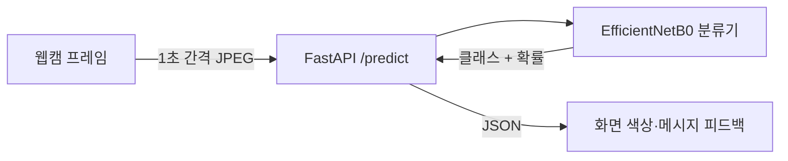

# C-Care — CNN을 활용한 시력 보호 모델

> 웹캠으로 사용자와 모니터 사이 거리를 분류해, 너무 가까우면 알려주어 눈의 피로를 줄이도록 돕는 CNN 모델입니다. 졸업 프로젝트 "CNN을 활용한 시력 보호 모델 설계".

모니터에 너무 가까이 붙어 오래 보면 눈이 쉽게 피로해집니다. C-Care는 웹캠 프레임을 EfficientNetB0(CNN) 분류기로 분석해 모니터와의 거리를 세 단계로 나누고, 너무 가까우면 화면에 색상·메시지로 경고해 시력 보호를 돕습니다.

## 주요 기능

- **거리 분류** — 웹캠 이미지를 `under4 / 4 / over4` 세 클래스로 분류합니다(모니터와의 거리 단계).
- **실시간 피드백** — 프론트엔드가 1초 간격으로 프레임을 백엔드에 보내고, 결과를 안전(초록)·주의(노랑)·위험(빨강) 색상과 메시지로 표시합니다(`under4`=위험, `4`=주의, `over4`=안전).
- **예측 API** — FastAPI `/predict` 엔드포인트가 이미지를 받아 예측 클래스와 확률을 JSON으로 반환합니다.

## 동작 방식



브라우저(`index.html`)가 `getUserMedia`로 웹캠 프레임을 캡처해 1초마다 서버로 전송합니다. 서버는 프레임을 224×224로 리사이즈해 EfficientNetB0(전이학습) 분류기에 입력하고, `softmax` 세 클래스 확률에서 최댓값을 결과로 사용합니다.

## 모델

- **백본**: EfficientNetB0(ImageNet 사전학습) 동결 + 분류 헤드(GAP → BatchNorm/Dropout → Dense 512 → Dense 1024 → Dense 3 softmax)
- **입력**: 224×224 RGB, 정규화(`/255`)
- **학습**: Nadam, categorical crossentropy, EarlyStopping·ReduceLROnPlateau
- **성능**: 자체 테스트 분할 기준 **정확도 약 82%**(단일 측정값)
- **학습 데이터 준비**: 원본 이미지 중 RetinaFace로 얼굴이 검출된 것만 남기고, 파일명 기준으로 거리 라벨을 부여(`src/data_preprocessing.py`)

## 기술 스택

| 영역 | 사용 기술 |
|---|---|
| 백엔드 | Python, FastAPI, Uvicorn |
| 모델 | TensorFlow / Keras (EfficientNetB0 전이학습) |
| 영상 처리 | OpenCV, RetinaFace(학습 데이터 준비용 얼굴 검출) |
| 프론트엔드 | HTML, JavaScript (`getUserMedia`, Fetch API) |

## 프로젝트 구조

```
C-Care/
├── app.py                      # FastAPI 서버 (/predict)
├── index.html                  # 웹캠 캡처 + 결과 표시 프론트엔드
├── src/
│   ├── data_preprocessing.py   # RetinaFace로 얼굴 이미지 선별 + 거리 라벨링
│   ├── train.py                # EfficientNetB0 전이학습
│   └── predict.py              # 모델 로드 + 단일 이미지 예측
├── models/                     # 학습된 .keras 모델
├── notebooks/                  # 실험용 노트북
├── assets/                     # 프로젝트 보고서 등
└── requirements.txt
```

## 실행 방법

```bash
pip install -r requirements.txt
# app.py의 MODEL_PATH가 models/ 안의 학습된 .keras 파일을 가리키는지 확인
uvicorn app:app --host 0.0.0.0 --port 8000
```

서버를 띄운 뒤 `index.html`을 브라우저에서 열고 웹캠 권한을 허용하면 거리 피드백이 동작합니다. API 문서는 `/docs`에서 확인할 수 있습니다.

## 배운 점

- **노트북에서 애플리케이션으로**: 초기 검증은 Jupyter에서 빠르게 했지만, 서비스로 만들면서 전처리·학습·예측을 모듈로 분리했고 그 과정에서 재현성과 유지보수가 쉬워졌습니다.
- **실시간 웹캠 연동**: Colab의 JavaScript 스니펫은 일회성 테스트에는 됐지만 서비스에는 부적합해서, FastAPI 백엔드와 브라우저 `getUserMedia`·`Fetch`로 클라이언트–서버 통신을 직접 구성했습니다.

## 참고

- **정확도 약 82%는 자체 데이터 테스트 분할 기준 단일 측정값**이며, 일반 사용 환경의 정확도를 보장하지는 않습니다.
- **RetinaFace는 학습 데이터 준비 단계에서만** 사용합니다(얼굴이 있는 이미지 선별). 추론 경로(`app.py`)는 얼굴 영역을 따로 잘라내지 않고 프레임 전체를 분류기에 입력합니다.
- 졸업 프로젝트로 진행했으며, 상세 내용은 `assets/`의 보고서를 참고하세요.
