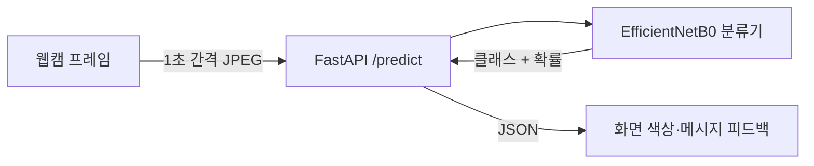

# CNN을 활용한 시력 보호 모델

웹캠 프레임을 EfficientNetB0 분류기로 분석해 모니터와 사용자 사이 거리를 세 단계로 나누고, 가까운 상태에서 색상·메시지로 경고하는 모델. 졸업 프로젝트 "CNN을 활용한 시력 보호 모델 설계" 의 개인 재구현본.

## 역할과 범위

- 원본: 팀 졸업 프로젝트(팀 "루모스", 6인). 본인 담당은 학습용 이미지 데이터 수집(팀원·지인 대상 촬영), 경고 화면 프론트엔드, 거리 분류 CNN 튜닝
- 이 저장소: 원본의 개인 재구현본. 노트북 위주였던 원본을 서비스 형태로 재구성하면서 FastAPI 백엔드와 전처리·학습·예측 모듈 분리를 추가
- 팀 전체 산출물과 상세 내용은 `assets/` 의 보고서 참고

## 주요 기능

- 거리 분류: 웹캠 이미지를 `under4` · `4` · `over4` 세 클래스로 분류
- 실시간 피드백: 프론트엔드가 1초 간격으로 프레임을 전송하고 결과를 안전(초록, `over4`) · 주의(노랑, `4`) · 위험(빨강, `under4`) 색상과 메시지로 표시
- 예측 API: FastAPI `/predict` 가 이미지를 받아 예측 클래스와 확률을 JSON 으로 반환

## 동작 방식


```mermaid
graph LR
    A[웹캠 프레임] -->|1초 간격 JPEG| B[FastAPI /predict]
    B --> C[EfficientNetB0 분류기]
    C -->|클래스 + 확률| B
    B -->|JSON| D[화면 색상·메시지 피드백]
```

브라우저(`index.html`)가 `getUserMedia` 로 캡처한 프레임을 1초 간격으로 서버에 전송. 서버는 BGR 을 RGB 로 변환한 뒤 224×224 리사이즈와 `/255` 정규화를 거쳐 분류기에 입력하고, softmax 세 클래스 확률의 최댓값을 결과로 사용.

## 모델

| 항목 | 내용 |
| --- | --- |
| 백본 | EfficientNetB0(ImageNet 사전학습), 전 계층 동결 |
| 분류 헤드 | GAP → BN·Dropout 0.5 → Dense 512 → BN·Dropout 0.5 → Dense 1024 → BN·Dropout 0.5 → Dense 3 softmax |
| 입력 | 224×224 RGB, `/255` 정규화 |
| 학습 | Nadam(lr 1e-3), categorical crossentropy, batch 32, epochs 50, EarlyStopping · ReduceLROnPlateau |
| 분할 | stratified 학습·테스트 7:3, 학습 중 validation 0.2 |
| 성능 | 자체 테스트 분할 기준 정확도 약 82%(단일 측정값) |

학습 데이터는 원본 이미지 중 RetinaFace 로 얼굴이 검출된 것만 남기고, 파일명 첫 자리 숫자로 거리 라벨을 부여해 구성(`src/data_preprocessing.py`).

## 기술 스택

| 영역 | 사용 기술 |
| --- | --- |
| 백엔드 | Python, FastAPI, Uvicorn |
| 모델 | TensorFlow / Keras (EfficientNetB0 전이학습) |
| 영상 처리 | OpenCV, RetinaFace(학습 데이터 준비 전용) |
| 프론트엔드 | HTML, JavaScript (`getUserMedia`, Canvas, Fetch API) |

## 저장소 구성

```
C-Care/
├── app.py                      # FastAPI 서버 (/predict)
├── index.html                  # 웹캠 캡처 + 결과 표시 프론트엔드
├── src/
│   ├── data_preprocessing.py   # RetinaFace 얼굴 선별 + 거리 라벨링
│   ├── train.py                # EfficientNetB0 전이학습
│   └── predict.py              # 모델 로드 + 단일 이미지 예측
├── models/                     # 학습된 .keras 모델
├── notebooks/                  # 원본 실험 노트북
├── assets/                     # 프로젝트 보고서
└── requirements.txt
```

## 실행 방법

```bash
pip install -r requirements.txt
uvicorn app:app --host 0.0.0.0 --port 8000
```

서버 기동 후 `index.html` 을 브라우저에서 열고 웹캠 권한을 허용하면 거리 피드백 동작. API 문서는 `/docs`.

전처리와 재학습은 `src/data_preprocessing.py` · `src/train.py` 를 직접 실행. 두 스크립트의 기본 입력 경로는 `../data/Dataset/`(학습 이미지는 저장소 미포함).

## 설계 결정

- 노트북에서 애플리케이션으로: 원본의 Colab 검증 흐름을 전처리 · 학습 · 예측 모듈로 분리
- 실시간 웹캠 연동: 원본의 Colab `IPython.display.Javascript` 경고 방식을 브라우저 `getUserMedia` 와 FastAPI 클라이언트-서버 구조로 교체

## 참고

- 정확도 약 82% 는 자체 데이터 테스트 분할 기준 단일 측정값이며, 일반 사용 환경의 정확도 보장과는 무관
- 서빙 모델 `models/EfficientNetB8282.keras` 는 원본 학습 시점 산출물로, `src/train.py` 재실행 산출물(`c-care_model.keras`)과는 별개 파일
- RetinaFace 는 학습 데이터 준비 단계에서만 사용. 추론 경로(`app.py`)는 얼굴 영역을 잘라내지 않고 프레임 전체를 분류기에 입력
